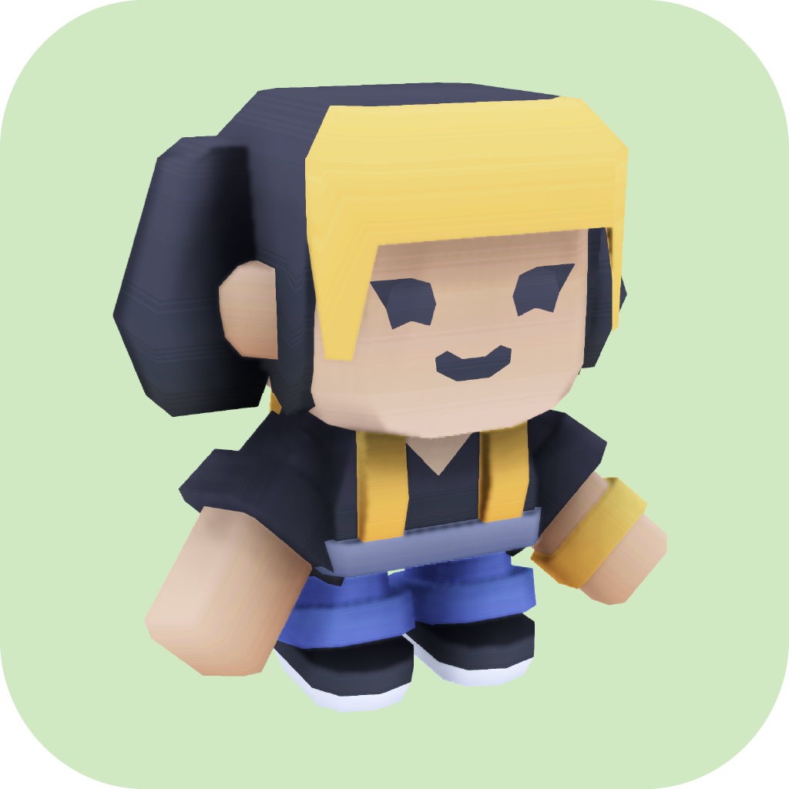

  <!--
  itch color: #fa5c5c
  github color: brightgreen
  label color: #505050
  mastodon color: #6364FF
  -->

  

    
    
  

   
  
  <h3 align="center">
   <code>Arielle's Big Day</code>
  </h3>
  <h6 align="center">
    a game made with love for the 
    greatest person in the world
  </h6>
  <h5 align="center">
    An N. Escobar Media Production
  </h4>
  <h4 align="center">
    designed and developed by <a href="https://nickesc.github.io">N. Escobar</a>
  </h4>
  

    
  

## Overview

`Arielle's Big Day` is a small game built as a birthday gift for my partner. Made using Godot 4.4.

### Install & Run

> Builds available for macOS only.

To install, go to the [Releases](https://github.com/nickesc/4ajs/releases/latest) page of the game's GitHub repository and download the latest release.

Unzip the downloaded file and run the `Arielle's Big Day.app` application inside.

> [!NOTE]
> The first time you run the game, macOS may show you this warning:
> 
> 
>
> To launch the game, open `System Settings` ▸ `Privacy & Security`, scroll down to `Security`, locate the warning and press `Open Anyway`

## Controls:

The game can either be controlled with `Mouse and Keyboard` or with a `Controller`.

In order to activate the second player, 2 controllers ***must*** be connected. 

### Mouse & Keyboard

#### Third-Person:
Button | Action
----|----
<kbd>WASD</kbd> | Move
<kbd>Space</kbd> | Jump
<kbd>E</kbd> | Interact
<kbd>R</kbd> | Reset

#### First-Person:

Button | Action
----|----
<kbd>WASD</kbd> | Move
<kbd>Space</kbd> | Jump
<kbd>Mouse</kbd> | Look
<kbd>LMB</kbd> | Shoot
<kbd>RMB</kbd> | Zoom
<kbd>E</kbd> | Change weapon
<kbd>R</kbd> | Reset

### Controller

 | 
----|----

## Screenshots

### Menu

  

### Scenes

    <code>Apartment Scene</code> 
 | 
    <code>Platformer Scene</code> 
 
----|----

    <code>Subway Scene</code> 
  | 
    <code>Shooter Scene</code> 

---|----
